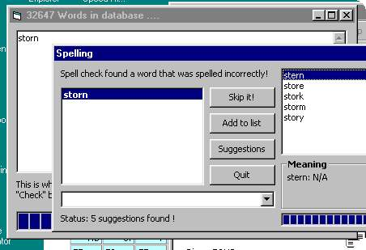



## AA a Smart Spell Checker with suggestions and over 32,000 words \(UPDATED\)

### Description

Dasith, Basically checks spellings and gives suggestions if the word is not found on the list.

I rewrote the whole programme and it's much faster and now has suggestions. The word.lst now has over 32,000 words.
 
### More Info
 
how to get the full 32,000 words list

Please download the word list at http://gerada.freeyellow.com/as/Spell_check.zip

             |
---                |---
**Submitted On**   |2003-10-27 16:24:50
**By**             |[Dasith Wijesiriwardena](https://github.com/Planet-Source-Code/PSCIndex/blob/master/ByAuthor/dasith-wijesiriwardena.md)
**Level**          |Advanced
**User Rating**    |4.9 (195 globes from 40 users)
**Compatibility**  |VB 5\.0, VB 6\.0
**Category**       |[Miscellaneous](https://github.com/Planet-Source-Code/PSCIndex/blob/master/ByCategory/miscellaneous__1-1.md)
**World**          |[Visual Basic](https://github.com/Planet-Source-Code/PSCIndex/blob/master/ByWorld/visual-basic.md)
**Archive File**   |[AA\_a\_Smart1668361162003\.zip](https://github.com/Planet-Source-Code/dasith-wijesiriwardena-aa-a-smart-spell-checker-with-suggestions-and-over-32-000-words-upd__1-49087/archive/master.zip)

